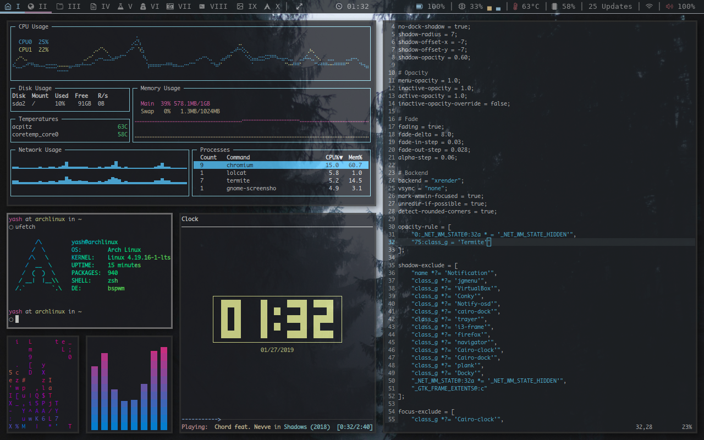

## [BSPWM] Arch Setup

> Details about the setup

**Reddit Link**: https://www.reddit.com/r/unixporn/comments/ajgm94/bspwm_my_first_rice_on_arch/

**Distro**: [Arch Linux](https://www.archlinux.org/)

**WM**: [BSPWM](https://github.com/baskerville/bspwm)

**Terminal**: [termite](https://github.com/thestinger/termite)

**Terminal Theme**: [termite-snazzy](https://github.com/kbobrowski/termite-snazzy)

**Text editor**: [neovim](https://github.com/neovim/neovim)

**Bar**: [Polybar](https://github.com/jaagr/polybar)

**Fetch**: [ufetch](https://gitlab.com/jschx/ufetch)

**Music Player/Clock**: [ncmpcpp](https://github.com/arybczak/ncmpcpp)

**Visualiser**: [cava](https://github.com/karlstav/cava)

**Shell**: [oh-my-zsh](https://github.com/robbyrussell/oh-my-zsh)

**Shell Prompt**: [dstufft](https://github.com/robbyrussell/oh-my-zsh/blob/master/themes/dstufft.zsh-theme)

**System Monitor**: [gotop](https://github.com/cjbassi/gotop)

**Others**: [pipes.sh](https://github.com/pipeseroni/pipes.sh), [cmatrix](https://github.com/abishekvashok/cmatrix)

> Setup screenshot below !

> Wallpaper below ! Click on it to download.

